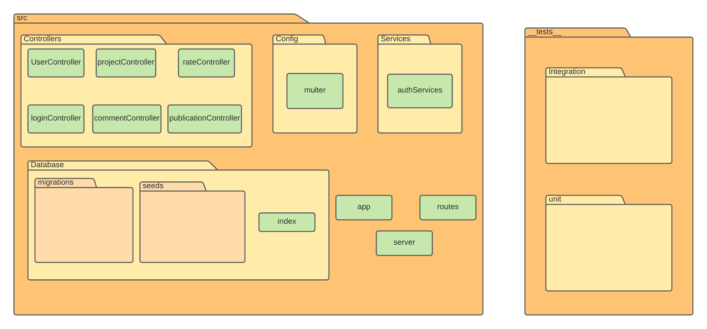

# Design das aplicações

## Design da API

A API da aplicação possui um módulo principal `src`, onde fica toda a lógica do programa. Nela há os arquivos `server`, `app` e `routes` que, respectivamente, são responsáveis por: ser a porta de entrada do servidor; configurar a API e listar as rotas com os métodos dos controllers.

No módulo `controller` ficam localizados os `controllers`, que são responsáveis por gerenciar os dados dos servidores à medida que uma rota é chamada. Os arquivos `multer` e `authServices` dentro de `Config` e `Services` são responsáveis por, respectivamente, configurar o upload de imagens e lidar com a autenticação de usuários.

O módulo `Database` é onde ficam armazenadas as `migrations` do banco de dados, as quais são necessárias durante a produção para se manter o controle de mudanças, e também as seeds que povoam o banco de dados.

O módulo `tests` é onde ficam armazenados os testes automatizados unitários e de integração os quais são usados apenas durante a fase de desenvolvimento, mas podendo também ser utilizados para o trabalho de integração contínua.
